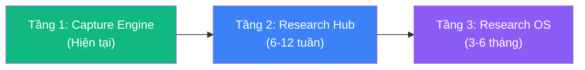
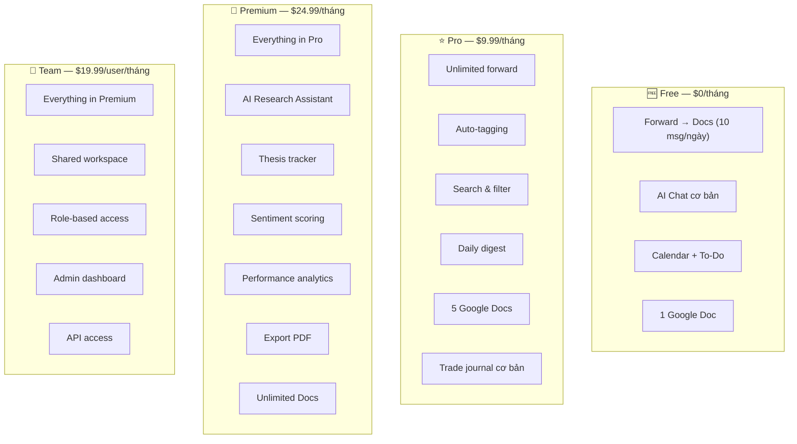
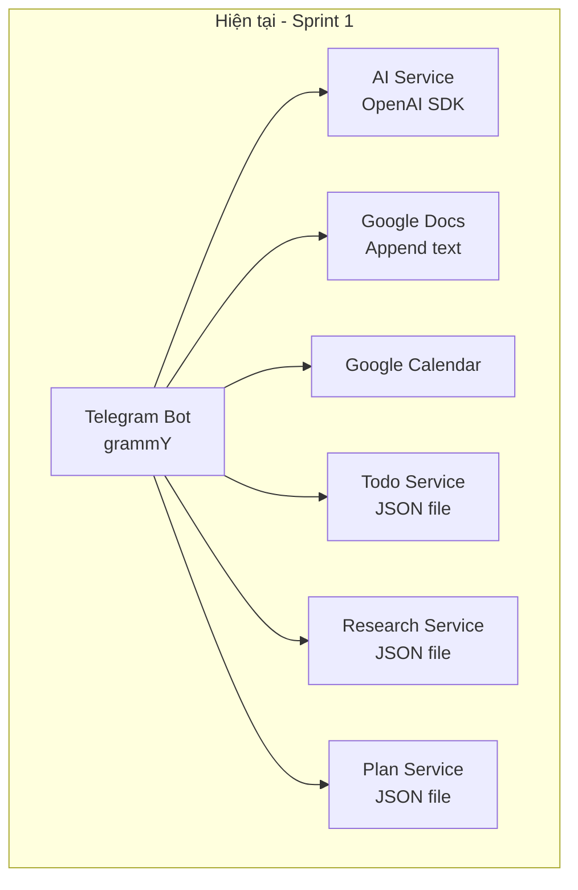
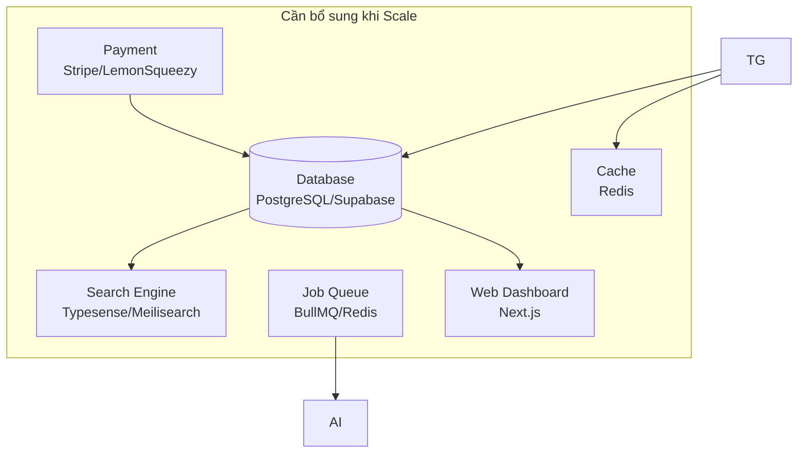

# EdgeBook (Bot Forward Docs → Research OS): Chiến lược kiếm tiền cho Trader/Investor

> **Brand: EdgeBook** — *"capture your edge."* Trading research OS sống trong Telegram.

## 0. Trạng thái hiện tại *(cập nhật 2026-05-31)*

| Hạng mục | Trạng thái |
|---|---|
| **Brand** | ✅ Rebrand "Bot Forward Docs" → **EdgeBook** (repo `shincapitals/edge-book`, npm `edgebook`, bot `@edgebook_bot`) |
| **Tầng 1 — Capture Engine** | ✅ Done (forward → Docs, AI chat, Calendar, To-Do, Shopee) |
| **Tầng 2 — Research Hub** | ✅ Done Sprint 1 (auto-tag, search, sentiment, daily digest, Ask AI) |
| **Tầng 3 — Trade Journal MVP** | ✅ Done Sprint 3 (log/close/PnL/stats — Pro) |
| **Research-to-trade link** | ✅ Done Sprint 4 (close lệnh → gợi ý research khớp ticker để link 🔗 — Premium) |
| **Hạ tầng AI** | ✅ Vertex-Key: chat `aws/claude-sonnet-4-6-medium-thinking`, fast `aws/claude-haiku-4-5` |

**Đang chờ / TODO vận hành:** `service_account.json` (Google APIs), LemonSqueezy keys (bật `/upgrade`).
**Sprint kế tiếp (ứng viên):** Premium Trade analytics (breakdown theo ticker/thời gian) + Export PDF → migrate JSON→DB → Phase 4 (Team & API).

---

## 1. Tại sao "Research OS" là hướng đi đúng?

### Vấn đề thực tế của trader/investor

| Pain Point | Mô tả | Bot Forward Docs giải quyết được |
|---|---|---|
| **Thông tin phân tán** | Research nằm rải rác: Telegram groups, Twitter/X, TradingView, Discord, email newsletters | ✅ Forward → lưu tập trung vào Google Docs |
| **Không tag/search được** | Forward xong quên, không tìm lại được theo ticker/topic | ⚠️ Chưa có — cần bổ sung |
| **Không có journal** | Trader ghi nhật ký giao dịch bằng tay hoặc không ghi | ⚠️ Chưa có — cần bổ sung |
| **Tốn thời gian tổng hợp** | Mỗi ngày phải đọc 10-20 channel mới biết sentiment thị trường | ⚠️ AI có thể summarize |
| **Không có workflow chuẩn** | Từ "đọc tin" → "phân tích" → "vào lệnh" → "review" không có tool nào cover hết | ⚠️ Cần thiết kế workflow |

### Tại sao Telegram Bot là lợi thế cạnh tranh?

```
Trader đã sống trên Telegram:
├── 80%+ research channels là Telegram groups
├── Signal groups, alpha calls, on-chain alerts
├── Không cần install thêm app
└── Forward = 1 tap → lưu ngay context gốc
```

> [!IMPORTANT]
> **Insight cốt lõi**: Đối thủ (Notion, Obsidian, TradingView) đều yêu cầu user rời Telegram để lưu thông tin. Bot Forward Docs giữ user trong Telegram — **zero-friction capture**.

---

## 2. Product Vision: 3 tầng tiến hóa



### Tầng 1 — Capture Engine *(đã có)*
- Forward text/photo → Google Docs
- AI chat cơ bản
- Calendar, To-Do
- Track giá Shopee (tính năng phụ thêm)

### Tầng 2 — Research Hub *(đã hoàn thành Sprint 1)*
- Auto-tagging ticker/pair (BTC, ETH, SOL...)
- Search & filter saved content
- Daily/weekly digest (AI summarize)
- Trade journal integration

### Tầng 3 — Full Research OS *(mục tiêu)*
- Multi-source aggregation (RSS, Twitter/X, Discord bridge)
- Portfolio tracking + PnL linkage
- AI analyst (sentiment, thesis validation)
- Team collaboration (shared research)
- API & webhook cho quant traders

---

## 3. Feature Roadmap chi tiết

### Phase 1: Smart Capture + Tagging (Đang triển khai - Sprint 1 DONE)

| Feature | Mô tả | Monetizable? |
|---|---|---|
| **Auto-tag tickers** | AI detect BTC, ETH, SOL... trong forwarded messages → gắn tag | ✅ Pro |
| **Category tagging** | Phân loại: Macro, On-chain, Technical, Fundamental, Alpha | ✅ Pro |
| **Source tracking** | Ghi nhận nguồn forward (channel name, user) | Free |
| **Bookmark & Star** | Reply "⭐" hoặc lệnh `Star` để đánh dấu quan trọng | Free |
| **Search command** | `Search: BTC` → tìm tất cả messages liên quan BTC | ✅ Pro |

#### Ví dụ UX flow:
```
User forwards message từ "Crypto Banter" channel:
"BTC đang test vùng $108k, nếu break thì target $115k. ETH/BTC ratio đang yếu."

Bot tự động:
1. Lưu vào Google Docs ✅
2. Tag: #BTC #ETH #Technical #CryptoBanter
3. Phản hồi kèm thông tin tag + sentiment
4. (Nếu Pro) Thêm vào daily digest
```

### Phase 2: AI Research Assistant (Đang triển khai - Sprint 1 DONE)

| Feature | Mô tả | Monetizable? |
|---|---|---|
| **Daily Digest** | 8:00 sáng gửi summary tất cả research hôm qua, group theo ticker | ✅ Pro |
| **Weekly Report** | Cuối tuần gửi report: top tickers, sentiment shift, key insights | ✅ Pro |
| **Ask about research** | `Ask: What did I save about BTC this week?` → AI trả lời từ saved data | ✅ Pro |
| **Thesis tracker** | Ghi thesis → AI nhắc khi có data mâu thuẫn | ✅ Premium |
| **Sentiment scoring** | AI score sentiment (bullish/bearish/neutral) mỗi forwarded message | ✅ Premium |

#### Ví dụ Daily Digest:
```
📊 Daily Research Digest — 29/05/2026

🔥 Top mentions: BTC (12), ETH (7), SOL (5)

📈 BTC:
- CryptoBanter: Test $108k, target $115k nếu break
- PlanB: S2F model on track, year-end $150k
- Glassnode: Long-term holders accumulating
Sentiment: 🟢 Bullish (8/10)

📉 ETH:
- Bankless: ETH/BTC ratio đang yếu
- Vitalik: Pectra upgrade timeline
Sentiment: 🟡 Neutral (5/10)

💡 Action items:
- Thesis "BTC $150k EOY" có 3 supporting signals
- ⚠️ ETH position cần review — 2 bearish signals mới
```

### Phase 3: Trade Journal & Portfolio (6-8 tuần)

| Feature | Mô tả | Monetizable? | Status |
|---|---|---|---|
| **Trade log** | `Trade: Long BTC entry 108k SL 105k TP 115k` | ✅ Pro | ✅ Sprint 3 DONE |
| **PnL tracking** | `Close: BTC 112k` hoặc `Close: BTC +3.2%` → tự tính PnL | ✅ Pro | ✅ Sprint 3 DONE |
| **Trade stats cơ bản** | `Trade Stats` — win rate, total PnL, avg RR, best/worst | ✅ Pro | ✅ Sprint 3 DONE |
| **Research-to-trade link** | Khi close trade, bot gợi ý research khớp ticker để link 🔗 | ✅ Premium | ✅ Sprint 4 DONE |
| **Performance analytics nâng cao** | Breakdown theo ticker/thời gian, AI insight | ✅ Premium | ⏳ |
| **Export PDF report** | Monthly trade report với charts | ✅ Premium | ⏳ |

### Phase 4: Team & API (8-12 tuần)

| Feature | Mô tả | Monetizable? |
|---|---|---|
| **Team workspace** | Shared research pool cho trading desk/group | ✅ Team plan |
| **Role-based access** | Analyst, Trader, Manager roles | ✅ Team plan |
| **Webhook/API** | Push data tới TradingView, custom dashboards | ✅ API plan |
| **Discord/Twitter bridge** | Forward từ Discord/X vào cùng research pool | ✅ Premium |

---

## 4. Pricing Strategy

### Mô hình Freemium + Tiered



### Phân tích hợp lý của pricing

| Tier | Target | Willingness to pay | Justification |
|---|---|---|---|
| **Free** | Casual crypto followers | $0 | Hook — tạo habit dùng bot |
| **Pro $9.99** | Active trader cá nhân | $10-20/tháng | Rẻ hơn TradingView Pro ($14.95), giải quyết pain khác |
| **Premium $24.99** | Serious trader/investor | $25-50/tháng | AI digest tiết kiệm 1-2 giờ/ngày đọc research |
| **Team $19.99/user** | Trading desk, fund, KOL group | $20-50/user | Thay thế Notion + Slack cho research workflow |

---

## 5. Technical Architecture Evolution

### Kiến trúc hiện tại của Sprint 1 (JSON persistence)



### Kiến trúc đề xuất cho quy mô lớn hơn



### Database Schema (Dự thảo Supabase)

```sql
-- Core tables
CREATE TABLE users (
    id BIGINT PRIMARY KEY,           -- Telegram user ID
    telegram_username TEXT,
    full_name TEXT,
    plan TEXT DEFAULT 'free',         -- free | pro | premium
    plan_expires_at TIMESTAMPTZ,
    created_at TIMESTAMPTZ DEFAULT now()
);

CREATE TABLE research_items (
    id UUID PRIMARY KEY DEFAULT gen_random_uuid(),
    user_id BIGINT REFERENCES users(id),
    content TEXT NOT NULL,
    source_channel TEXT,              -- forwarded from
    source_url TEXT,
    tickers TEXT[],                   -- ['BTC', 'ETH', 'SOL']
    categories TEXT[],                -- ['technical', 'macro']
    sentiment FLOAT,                  -- -1.0 to 1.0
    is_starred BOOLEAN DEFAULT false,
    google_doc_id TEXT,
    created_at TIMESTAMPTZ DEFAULT now()
);

CREATE TABLE trades (
    id UUID PRIMARY KEY DEFAULT gen_random_uuid(),
    user_id BIGINT REFERENCES users(id),
    ticker TEXT NOT NULL,
    direction TEXT,                   -- 'long' | 'short'
    entry_price DECIMAL,
    exit_price DECIMAL,
    stop_loss DECIMAL,
    take_profit DECIMAL,
    pnl_percent DECIMAL,
    status TEXT DEFAULT 'open',       -- open | closed | cancelled
    linked_research UUID[] DEFAULT '{}', -- links to research_items
    notes TEXT,
    opened_at TIMESTAMPTZ DEFAULT now(),
    closed_at TIMESTAMPTZ
);
```

---

## 6. Go-to-Market Strategy

### Phân khúc khách hàng mục tiêu
- **Crypto Trader (retail)**: 45%
- **Stock/Forex Trader VN**: 25%
- **Crypto Fund/Desk**: 15%
- **KOL/Analyst**: 10%
- **Quant/Developer**: 5%

### Kênh phân phối chính
1. **Telegram Groups**: Seed bot vào crypto VN groups (10-20 groups), giới thiệu free tier.
2. **Twitter/X Crypto VN**: Viết content chia sẻ: *"Cách tôi quản lý 200+ nguồn tin crypto mỗi tuần bằng Telegram Bot"*.
3. **KOL Partnership**: Tặng tài khoản Premium miễn phí cho KOL đổi lấy lượt đề xuất.
4. **Growth Loop Tự Nhiên**: User chia sẻ các bản Digest chất lượng có đính link cài bot tới các hội nhóm.
