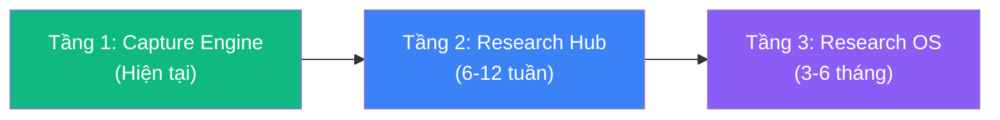
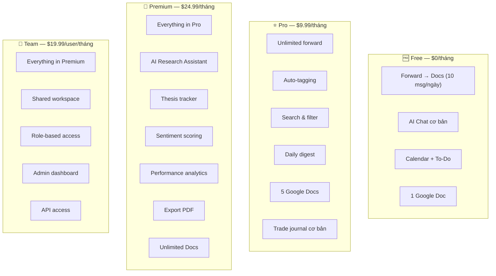
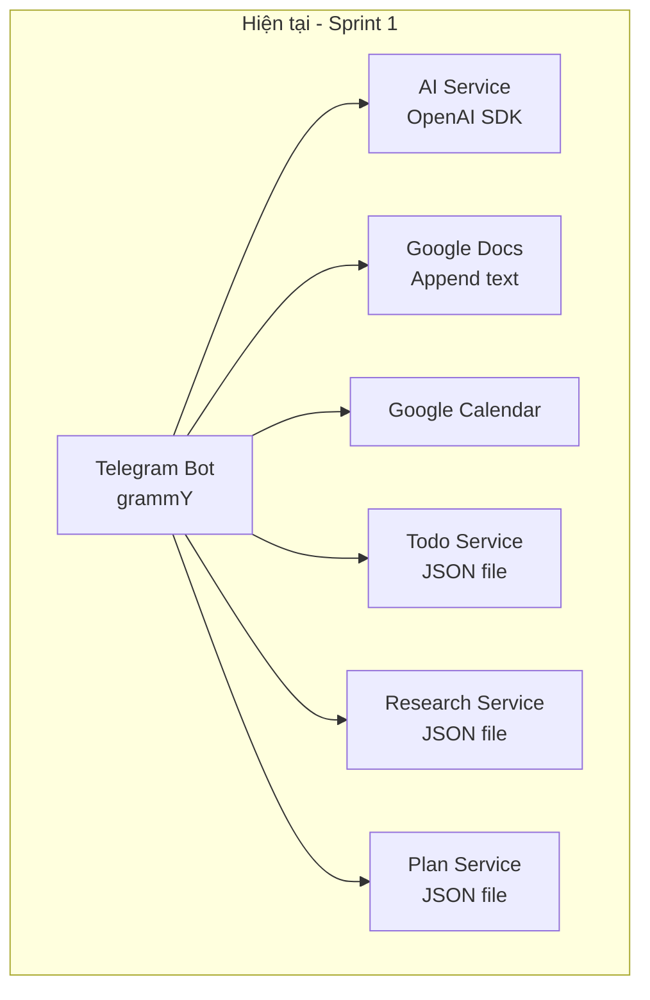
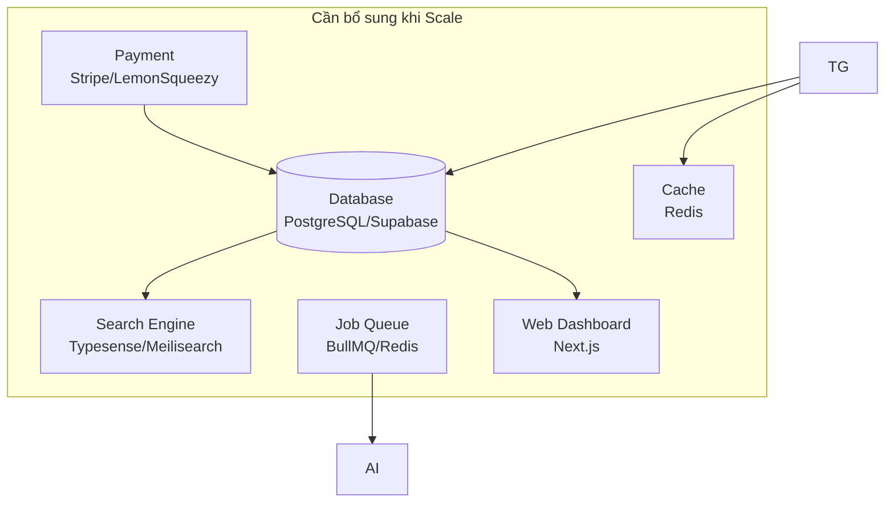

# EdgeBook (Bot Forward Docs → Research OS): Chiến lược kiếm tiền cho Trader/Investor

> **Brand: EdgeBook** — *"capture your edge."* Trading research OS sống trong Telegram.

## 0. Trạng thái hiện tại *(cập nhật 2026-06-01)*

| Hạng mục | Trạng thái |
|---|---|
| **Brand** | ✅ Rebrand "Bot Forward Docs" → **EdgeBook** (repo `shincapitals/edge-book`, npm `edgebook`, bot `@edgebook_bot` — token đã trỏ đúng bot, chạy live) |
| **Tầng 1 — Capture Engine** | ✅ Done (forward → Docs, AI chat, Calendar, To-Do) |
| **Tầng 2 — Research Hub** | ✅ **Hoàn tất 100%** — Sprint 1 (auto-tag, search, sentiment, daily digest, Ask AI) + Weekly Report (Sprint 5 — Pro) + Thesis tracker (Sprint 6 — Premium) |
| **Tầng 3 — Trade Journal MVP** | ✅ Done Sprint 3 (log/close/PnL/stats — Pro) |
| **Research-to-trade link** | ✅ Done Sprint 4 (close lệnh → gợi ý research khớp ticker để link 🔗 — Premium) |
| **Performance analytics nâng cao** | ✅ Done Sprint 4 (`Trade Analytics`: breakdown ticker/hướng/tháng + avg hold + AI insight — Premium) |
| **Export PDF report** | ✅ Done Sprint 4 (`Export PDF`: báo cáo PDF qua pdfkit — summary, monthly bar chart, breakdown ticker/hướng, trade log — Premium) |
| **Hạ tầng AI** | ✅ Vertex-Key: chat `aws/claude-sonnet-4-6-medium-thinking`, fast `aws/claude-haiku-4-5` |
| **Local test** | ✅ Bot `@edgebook_bot` chạy được (`npm start`), Trade/Research/Analytics/Export PDF test OK không cần Google. User test set Premium thủ công qua `data/plans.json` |
| **Bugfix forward** | ✅ 2026-06-01 — sửa nhận diện forward theo `forward_origin` (Bot API 7.0 đã bỏ `forward_date`/`forward_from`); trước đó forward ảnh → bot im lặng, forward text → không lưu research |
| **Current Doc link** | ✅ 2026-06-01 — lệnh `Current Doc` trả link Google Docs clickable + alias (không chỉ ID) |
| **Admin accounts** | ✅ 2026-06-01 — `ADMIN_USER_IDS` trong `.env`: các Telegram ID là admin luôn được coi là Premium (mọi gate pass, unlimited forward, luôn digest-eligible). Thay cho việc set tier thủ công trong `data/plans.json` |

> **Tầng 2 (Research Hub / Phase 2) và Tầng 3 (Trade Journal / Phase 3) đều hoàn tất 100%.** Mọi feature monetizable Free/Pro/Premium đã build xong. Việc còn lại là hạ tầng (DB), mở rộng (Phase 4 Team & API), và vận hành (secrets/payment).

### Roadmap còn lại
| Hạng mục | Loại | Ưu tiên |
|---|---|---|
| Migrate JSON → DB (PostgreSQL/Supabase) | Hạ tầng | 🔴 Cao — gỡ giới hạn "1 instance", nền tảng cho Phase 4 |
| Phase 4 — Team workspace, role-based, Webhook/API, Discord/X bridge | Feature lớn | 🟡 Sau DB |
| Tầng 3 vision — multi-source aggregation, portfolio/PnL linkage, web dashboard (Next.js) | Feature lớn | 🟢 Dài hạn |
| Go-to-Market (§6 — seed groups, content, KOL) | Tăng trưởng | 🟡 Song song |
| `service_account.json`, LemonSqueezy keys | Vận hành | 🔴 Blocker để chạy thật (`.env.example` ✅ đã có) |

**Đang chờ / TODO vận hành:**
- `service_account.json` (Google APIs — Save Docs/Calendar/upload ảnh). **Gitignored** → không có khi `git pull`; phải copy thủ công sang từng máy (USB / password manager), KHÔNG commit.
- `.env` cũng gitignored — copy thủ công. ✅ Đã có `.env.example` document đủ 14 biến + default; chỉ cần `cp .env.example .env` rồi điền giá trị.
- LemonSqueezy keys (bật `/upgrade`). Khi chưa có → test Premium bằng cách thêm Telegram ID vào `ADMIN_USER_IDS` trong `.env` (admin luôn = Premium), hoặc set tier thủ công trong `data/plans.json`.
- ⚠️ Chỉ chạy **1 instance** (long-poll Telegram + JSON file-based, 2 instance sẽ 409 Conflict & hỏng data).

**Sprint kế tiếp (ứng viên):** Migrate JSON→DB (PostgreSQL/Supabase) → Phase 4 (Team & API).

---

## 1. Tại sao "Research OS" là hướng đi đúng?

### Vấn đề thực tế của trader/investor

| Pain Point | Mô tả | Bot Forward Docs giải quyết được |
|---|---|---|
| **Thông tin phân tán** | Research nằm rải rác: Telegram groups, Twitter/X, TradingView, Discord, email newsletters | ✅ Forward → lưu tập trung vào Google Docs |
| **Không tag/search được** | Forward xong quên, không tìm lại được theo ticker/topic | ⚠️ Chưa có — cần bổ sung |
| **Không có journal** | Trader ghi nhật ký giao dịch bằng tay hoặc không ghi | ⚠️ Chưa có — cần bổ sung |
| **Tốn thời gian tổng hợp** | Mỗi ngày phải đọc 10-20 channel mới biết sentiment thị trường | ⚠️ AI có thể summarize |
| **Không có workflow chuẩn** | Từ "đọc tin" → "phân tích" → "vào lệnh" → "review" không có tool nào cover hết | ⚠️ Cần thiết kế workflow |

### Tại sao Telegram Bot là lợi thế cạnh tranh?

```
Trader đã sống trên Telegram:
├── 80%+ research channels là Telegram groups
├── Signal groups, alpha calls, on-chain alerts
├── Không cần install thêm app
└── Forward = 1 tap → lưu ngay context gốc
```

> [!IMPORTANT]
> **Insight cốt lõi**: Đối thủ (Notion, Obsidian, TradingView) đều yêu cầu user rời Telegram để lưu thông tin. Bot Forward Docs giữ user trong Telegram — **zero-friction capture**.

---

## 2. Product Vision: 3 tầng tiến hóa



### Tầng 1 — Capture Engine *(đã có)*
- Forward text/photo → Google Docs
- AI chat cơ bản
- Calendar, To-Do

### Tầng 2 — Research Hub *(đã hoàn thành Sprint 1)*
- Auto-tagging ticker/pair (BTC, ETH, SOL...)
- Search & filter saved content
- Daily/weekly digest (AI summarize)
- Trade journal integration

### Tầng 3 — Full Research OS *(mục tiêu)*
- Multi-source aggregation (RSS, Twitter/X, Discord bridge)
- Portfolio tracking + PnL linkage
- AI analyst (sentiment, thesis validation)
- Team collaboration (shared research)
- API & webhook cho quant traders

---

## 3. Feature Roadmap chi tiết

### Phase 1: Smart Capture + Tagging (Đang triển khai - Sprint 1 DONE)

| Feature | Mô tả | Monetizable? |
|---|---|---|
| **Auto-tag tickers** | AI detect BTC, ETH, SOL... trong forwarded messages → gắn tag | ✅ Pro |
| **Category tagging** | Phân loại: Macro, On-chain, Technical, Fundamental, Alpha | ✅ Pro |
| **Source tracking** | Ghi nhận nguồn forward (channel name, user) | Free |
| **Bookmark & Star** | Reply "⭐" hoặc lệnh `Star` để đánh dấu quan trọng | Free |
| **Search command** | `Search: BTC` → tìm tất cả messages liên quan BTC | ✅ Pro |

#### Ví dụ UX flow:
```
User forwards message từ "Crypto Banter" channel:
"BTC đang test vùng $108k, nếu break thì target $115k. ETH/BTC ratio đang yếu."

Bot tự động:
1. Lưu vào Google Docs ✅
2. Tag: #BTC #ETH #Technical #CryptoBanter
3. Phản hồi kèm thông tin tag + sentiment
4. (Nếu Pro) Thêm vào daily digest
```

### Phase 2: AI Research Assistant (Đang triển khai - Sprint 1 DONE)

| Feature | Mô tả | Monetizable? |
|---|---|---|
| **Daily Digest** | 8:00 sáng gửi summary tất cả research hôm qua, group theo ticker | ✅ Pro |
| **Weekly Report** | Cuối tuần gửi report: top tickers, sentiment shift, key insights | ✅ Pro (✅ Sprint 5 DONE — cmd `Weekly Report` + cron CN 18:00) |
| **Ask about research** | `Ask: What did I save about BTC this week?` → AI trả lời từ saved data | ✅ Pro |
| **Thesis tracker** | Ghi thesis → nhắc khi có data mâu thuẫn (rule-based sentiment) | ✅ Premium (✅ Sprint 6 DONE — `Thesis:` / `Theses` / `Close Thesis:`) |
| **Sentiment scoring** | AI score sentiment (bullish/bearish/neutral) mỗi forwarded message | ✅ Premium |

#### Ví dụ Daily Digest:
```
📊 Daily Research Digest — 29/05/2026

🔥 Top mentions: BTC (12), ETH (7), SOL (5)

📈 BTC:
- CryptoBanter: Test $108k, target $115k nếu break
- PlanB: S2F model on track, year-end $150k
- Glassnode: Long-term holders accumulating
Sentiment: 🟢 Bullish (8/10)

📉 ETH:
- Bankless: ETH/BTC ratio đang yếu
- Vitalik: Pectra upgrade timeline
Sentiment: 🟡 Neutral (5/10)

💡 Action items:
- Thesis "BTC $150k EOY" có 3 supporting signals
- ⚠️ ETH position cần review — 2 bearish signals mới
```

### Phase 3: Trade Journal & Portfolio (6-8 tuần)

| Feature | Mô tả | Monetizable? | Status |
|---|---|---|---|
| **Trade log** | `Trade: Long BTC entry 108k SL 105k TP 115k` | ✅ Pro | ✅ Sprint 3 DONE |
| **PnL tracking** | `Close: BTC 112k` hoặc `Close: BTC +3.2%` → tự tính PnL | ✅ Pro | ✅ Sprint 3 DONE |
| **Trade stats cơ bản** | `Trade Stats` — win rate, total PnL, avg RR, best/worst | ✅ Pro | ✅ Sprint 3 DONE |
| **Research-to-trade link** | Khi close trade, bot gợi ý research khớp ticker để link 🔗 | ✅ Premium | ✅ Sprint 4 DONE |
| **Performance analytics nâng cao** | Breakdown theo ticker/thời gian, AI insight | ✅ Premium | ✅ Sprint 4 DONE |
| **Export PDF report** | Monthly trade report với charts | ✅ Premium | ✅ Sprint 4 DONE |

### Phase 4: Team & API (8-12 tuần)

| Feature | Mô tả | Monetizable? |
|---|---|---|
| **Team workspace** | Shared research pool cho trading desk/group | ✅ Team plan |
| **Role-based access** | Analyst, Trader, Manager roles | ✅ Team plan |
| **Webhook/API** | Push data tới TradingView, custom dashboards | ✅ API plan |
| **Discord/Twitter bridge** | Forward từ Discord/X vào cùng research pool | ✅ Premium |

---

## 4. Pricing Strategy

### Mô hình Freemium + Tiered



### Phân tích hợp lý của pricing

| Tier | Target | Willingness to pay | Justification |
|---|---|---|---|
| **Free** | Casual crypto followers | $0 | Hook — tạo habit dùng bot |
| **Pro $9.99** | Active trader cá nhân | $10-20/tháng | Rẻ hơn TradingView Pro ($14.95), giải quyết pain khác |
| **Premium $24.99** | Serious trader/investor | $25-50/tháng | AI digest tiết kiệm 1-2 giờ/ngày đọc research |
| **Team $19.99/user** | Trading desk, fund, KOL group | $20-50/user | Thay thế Notion + Slack cho research workflow |

---

## 5. Technical Architecture Evolution

### Kiến trúc hiện tại của Sprint 1 (JSON persistence)



### Kiến trúc đề xuất cho quy mô lớn hơn



### Database Schema (Dự thảo Supabase)

```sql
-- Core tables
CREATE TABLE users (
    id BIGINT PRIMARY KEY,           -- Telegram user ID
    telegram_username TEXT,
    full_name TEXT,
    plan TEXT DEFAULT 'free',         -- free | pro | premium
    plan_expires_at TIMESTAMPTZ,
    created_at TIMESTAMPTZ DEFAULT now()
);

CREATE TABLE research_items (
    id UUID PRIMARY KEY DEFAULT gen_random_uuid(),
    user_id BIGINT REFERENCES users(id),
    content TEXT NOT NULL,
    source_channel TEXT,              -- forwarded from
    source_url TEXT,
    tickers TEXT[],                   -- ['BTC', 'ETH', 'SOL']
    categories TEXT[],                -- ['technical', 'macro']
    sentiment FLOAT,                  -- -1.0 to 1.0
    is_starred BOOLEAN DEFAULT false,
    google_doc_id TEXT,
    created_at TIMESTAMPTZ DEFAULT now()
);

CREATE TABLE trades (
    id UUID PRIMARY KEY DEFAULT gen_random_uuid(),
    user_id BIGINT REFERENCES users(id),
    ticker TEXT NOT NULL,
    direction TEXT,                   -- 'long' | 'short'
    entry_price DECIMAL,
    exit_price DECIMAL,
    stop_loss DECIMAL,
    take_profit DECIMAL,
    pnl_percent DECIMAL,
    status TEXT DEFAULT 'open',       -- open | closed | cancelled
    linked_research UUID[] DEFAULT '{}', -- links to research_items
    notes TEXT,
    opened_at TIMESTAMPTZ DEFAULT now(),
    closed_at TIMESTAMPTZ
);
```

---

## 6. Go-to-Market Strategy

### Phân khúc khách hàng mục tiêu
- **Crypto Trader (retail)**: 45%
- **Stock/Forex Trader VN**: 25%
- **Crypto Fund/Desk**: 15%
- **KOL/Analyst**: 10%
- **Quant/Developer**: 5%

### Kênh phân phối chính
1. **Telegram Groups**: Seed bot vào crypto VN groups (10-20 groups), giới thiệu free tier.
2. **Twitter/X Crypto VN**: Viết content chia sẻ: *"Cách tôi quản lý 200+ nguồn tin crypto mỗi tuần bằng Telegram Bot"*.
3. **KOL Partnership**: Tặng tài khoản Premium miễn phí cho KOL đổi lấy lượt đề xuất.
4. **Growth Loop Tự Nhiên**: User chia sẻ các bản Digest chất lượng có đính link cài bot tới các hội nhóm.

---

## 7. Kế hoạch Migration JSON → DB *(🔴 ưu tiên hạ tầng kế tiếp)*

> **Mục tiêu:** gỡ giới hạn "chỉ 1 instance", có persistence bền/transaction, nền tảng cho Phase 4 (Team & API) + web dashboard. Giữ nguyên hành vi bot — đây là refactor hạ tầng, không phải đổi feature.

### 7.1 Stack đề xuất (default)

| Hạng mục | Lựa chọn | Lý do |
|---|---|---|
| **DB host** | **Supabase** (managed Postgres) | Free tier ~500MB, có dashboard + REST/Realtime + auth sẵn; tái dùng được cho web dashboard Tầng 3. Connection qua `DATABASE_URL`. |
| **Query layer** | **Drizzle ORM** | TypeScript-first, nhẹ, SQL-like, type-safe, có `drizzle-kit` cho migration. Ít "magic", hợp schema đơn giản + solo dev. |
| **Rollout** | **Repository pattern + big-bang** | Tách tầng data-access, chuyển cả 7 service sang async, chạy 1 script seed JSON→DB, test rồi cắt. Dứt điểm, không phải nuôi code dual-write. |

> ⚠️ **Quyết định chưa chốt** (mặc định ở trên, đổi nếu cần): Supabase vs Postgres self-host vs SQLite · Drizzle vs Prisma vs raw `pg`. SQLite **không** gỡ được multi-instance nên không khuyến nghị nếu định scale ngang.

### 7.2 Hiện trạng cần thay (audit codebase)

6 service đều cùng anti-pattern cần bỏ:
- In-memory `Map<userId, T>` + đọc cả file lúc khởi tạo (`loadData()`), **ghi đè nguyên file mỗi mutation** (`saveData()`).
- **Toàn bộ method là sync** (return thẳng giá trị) → đây là phần đụng chạm lớn nhất khi chuyển async.
- `trades`/`theses` đã ghi atomic (tmp+rename); `users`/`todos`/`plans`/`research` ghi trực tiếp (race-prone).

| Service | File JSON | Bảng DB đích | Khóa |
|---|---|---|---|
| UserService | `users.json` | `users` | userId (PK) |
| PlanService | `plans.json` | `plans` | userId (PK) |
| ResearchService | `research.json` | `research_items` | id (PK), userId (FK) |
| TradeService | `trades.json` | `trades` | id (PK), userId (FK) |
| ThesisService | `theses.json` | `theses` | id (PK), userId (FK) |
| TodoService | `todos.json` | `todos` | id (PK), userId (FK) |

> Lưu ý mở rộng schema §5: bản dự thảo §5 mới có `users`/`research_items`/`trades`. Cần bổ sung `plans`, `theses`, `todos` và các cột còn thiếu (vd `plans.ls_order_id`, `users.doc_aliases JSONB`, `research_items.is_starred`, `trades.linked_research`).

### 7.3 Các bước triển khai (theo thứ tự)

1. **Setup hạ tầng**
   - Tạo project Supabase, lấy `DATABASE_URL` (pooler + direct).
   - Thêm `DATABASE_URL` (và `DIRECT_URL` nếu cần) vào `.env` + `.env.example` + `config.ts`.
   - `npm i drizzle-orm postgres` + `npm i -D drizzle-kit`.

2. **Định nghĩa schema** (`src/db/schema.ts`)
   - Map 1-1 từ 7 interface hiện có (`UserProfile`, `UserPlan`, `ResearchItem`, `TradeItem`, `ThesisItem`, `TodoItem`, `TrackedItem`).
   - `userId` kiểu `bigint` (Telegram ID). Mảng (`tickers`, `categories`, `linkedResearch`) → `text[]`; `docAliases` → `jsonb`. Timestamp giữ ISO/`timestamptz`.
   - Sinh migration: `drizzle-kit generate` → `migrate`.

3. **Tầng kết nối** (`src/db/index.ts`)
   - 1 connection pool dùng chung, export `db`. Đọc `DATABASE_URL` từ config.

4. **Script seed một lần** (`src/scripts/migrate-json-to-db.ts`)
   - Đọc 7 file trong `data/`, insert vào DB (idempotent: `onConflictDoNothing`/upsert theo PK).
   - In số bản ghi đã chuyển / bỏ qua để verify. Chạy: `npx ts-node src/scripts/migrate-json-to-db.ts`.

5. **Viết lại 7 service (async)**
   - Giữ nguyên tên + chữ ký public method, đổi return thành `Promise<...>`.
   - Bỏ `Map` + `loadData/saveData`; thay bằng query Drizzle. Mutation thành `INSERT/UPDATE/DELETE` đơn dòng (hết cảnh ghi đè cả file).
   - Logic thuần (auto-tag, sentiment, classify ở ResearchService; tính PnL/analytics ở TradeService) giữ nguyên — chỉ phần I/O đổi.

6. **Cập nhật call site** (`index.ts`, `webhook.server.ts`, cron jobs)
   - Thêm `await` cho mọi lời gọi service. Handler grammY/webhook vốn đã async → an toàn.
   - Đặc biệt soát: cron daily digest (08:00), weekly report (CN 18:00), downgrade plan hết hạn, `getAllUserIds()`.

7. **Test & cắt**
   - `npm run build` pass; chạy bot `@edgebook_bot`, test luồng chính: Save research → tag, Trade open/close → PnL, `Search`/`Digest`/`Weekly Report`/`Thesis`, `/upgrade` webhook set tier.
   - Verify data khớp giữa JSON cũ và DB.
   - Sau khi ổn: gỡ `data/*.json` khỏi luồng đọc (giữ file làm backup), cập nhật CLAUDE.md (bỏ cảnh báo "chỉ 1 instance" + mục "No database").

### 7.4 Rủi ro & lưu ý

- **Async ripple:** quên 1 `await` → bug ngầm (so sánh Promise, ghi đè state). Soát kỹ ở §7.3 bước 6; cân nhắc bật ESLint `no-floating-promises`.
- **`Date.now()`/reset hằng ngày:** logic reset `dailyForwardCount` theo `lastResetDate` (PlanService) chuyển nguyên sang DB, không đổi.
- **Idempotency thanh toán:** `plans.ls_order_id` phải `UNIQUE` để webhook LemonSqueezy không cộng tier 2 lần.
- **Multi-instance thật sự đạt được** chỉ khi bỏ hết state in-memory (Map). Nếu giữ cache, phải có invalidation — giai đoạn này nên query thẳng DB cho đơn giản.
- **Rollback:** giữ `data/*.json` + script seed; nếu lỗi nặng, revert service về bản JSON và chạy lại bot.

### 7.5 Ước lượng

| Khối | Quy mô |
|---|---|
| Setup Supabase + Drizzle + schema + connection | Nhỏ |
| Script seed JSON→DB | Nhỏ |
| Viết lại 7 service async | Trung bình (phần nặng nhất) |
| Cập nhật call site + cron + test | Trung bình |

→ Gói gọn 1 sprint hạ tầng ("Sprint 7 — DB Migration"). Sau khi xong mới mở khoá Phase 4 (Team workspace, role-based, Webhook/API).
